# :book: Laravel 8.0 - Content Management System

This is an ECMS Project developed with Laravel 8. I've used 2 integrated Bootstrap Theme for Control Panel and Frontend. I've specified the project as a personal blog. But the properties are avaliable to use of an enterprise company.

###  :sassy_man: Properties:

⇒ An Exhaustive Control Panel,

⇒ Tables (Modules) used: Blog Posts,Projects,Pages,Sliders,Users,Settings

⇒ Useful and Functional CRUD Sytem for each,

⇒ Authenticated Login Page

⇒ Access Permission Control by User Role

⇒ User-friendly customizations in UI Design

### :hammer: Libraries & Frameworks & Tools Used

⇒ Laravel 8.0,Bootstrap,Jquery,FontAwesome,CkEditor,Alertify JS

# :book: Laravel 8.0 - İçerik Yönetim Sistemi 

Bu proje Laravel 8.0 ile geliştirilmiş bir ECMS (Kurumsal İçerik Yönteim Sistemi) projesidir. Projede Yönetim Paneli ve Frontend kısmına entegre 2 adet hazır Bootstrap teması kullandım. Projeyi bir kişisel blog tarzında özelleştirdim. Ancak özellikler kurumsal bir şirketin kullanabileceği şekildedir.

###  :sassy_man: Özellikler:

⇒ Kapsamlı Kontrol Paneli,

⇒ Kullandığım Tablolar(Modüller): Blog Posts,Projects,Pages,Sliders,Users,Settings

⇒ Her tablo için kullanışlı ve fonksiyonel CRUD Sistemi

⇒ Kimlik Doğrulamalı Giriş Paneli

⇒ Kullanıcı rolüne göre Erişim İzni kontrolü

⇒ UI Tasarımında kullanıcı dostu iyileştirmeler

### :hammer: Kullanılan Kütüphane & Framework ve Araçlar

⇒ Laravel 8.0,Bootstrap,Jquery,FontAwesome,CkEditor,Alertify JS

### :camera_flash: Preview / Önizleme:

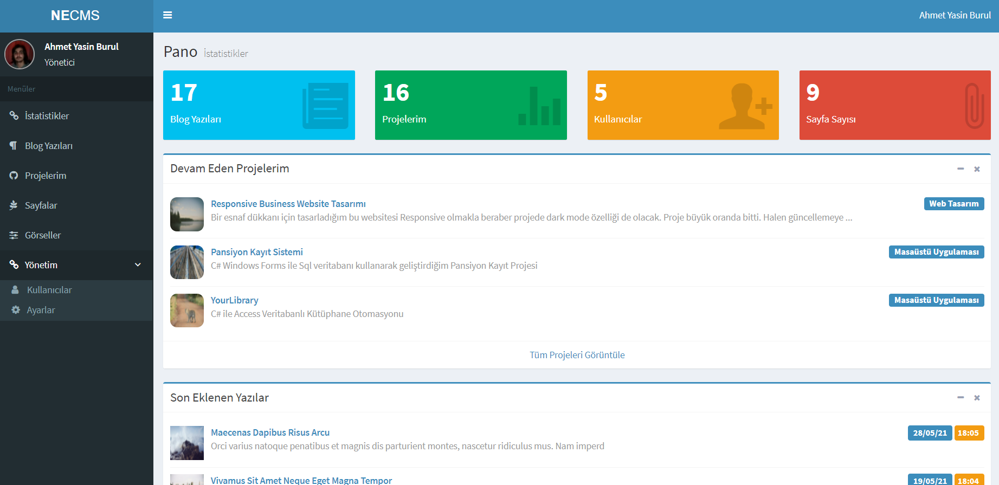

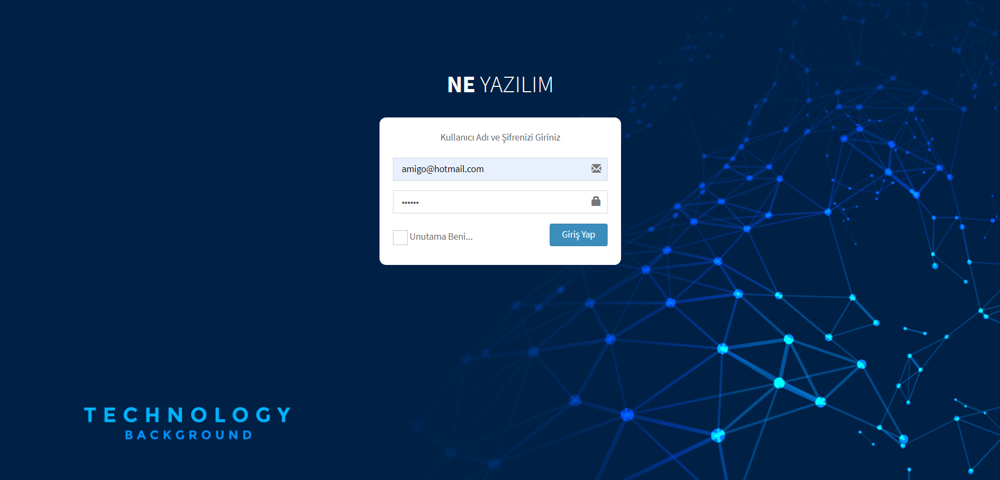

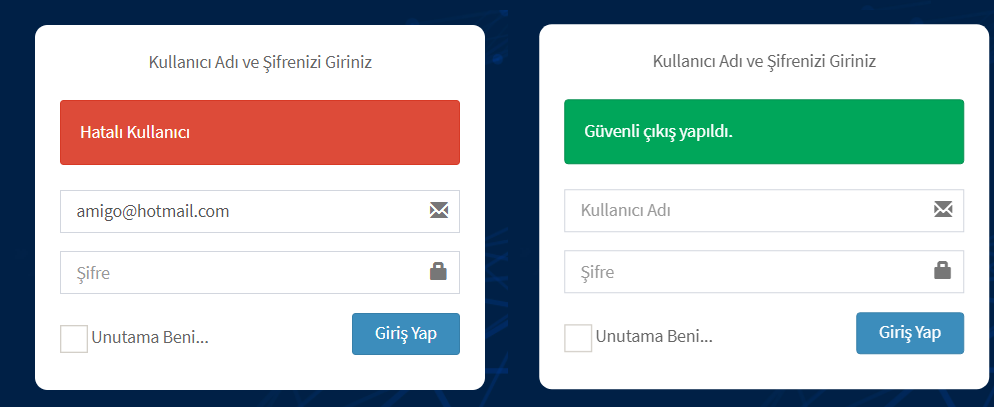

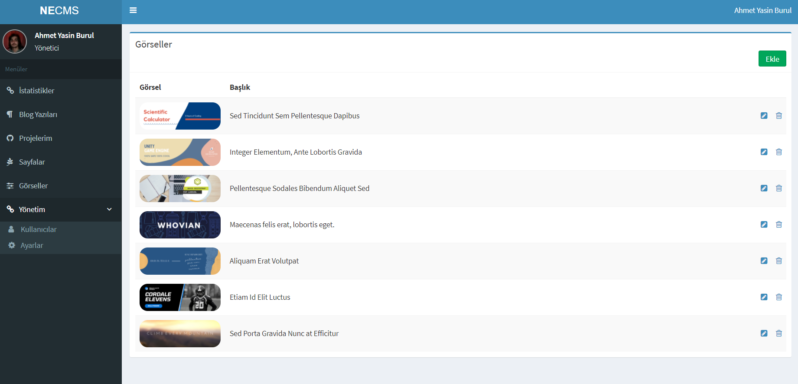

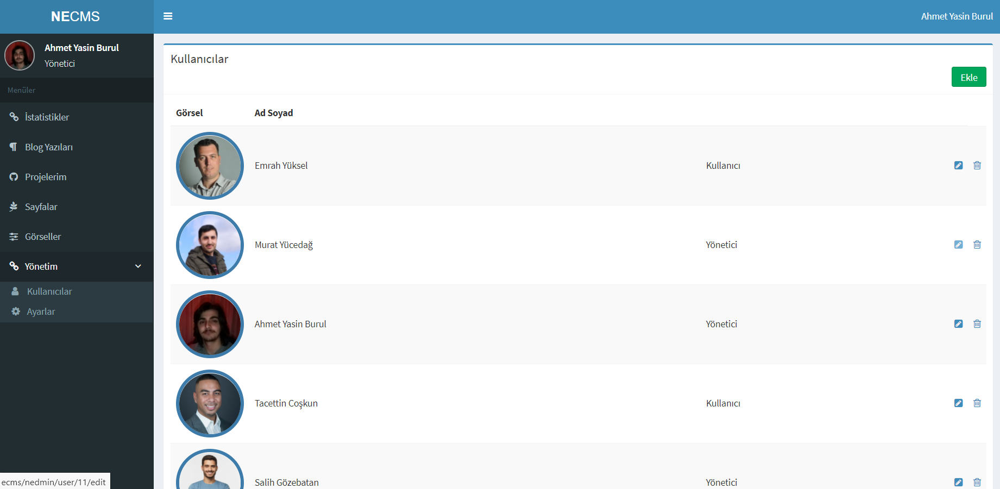

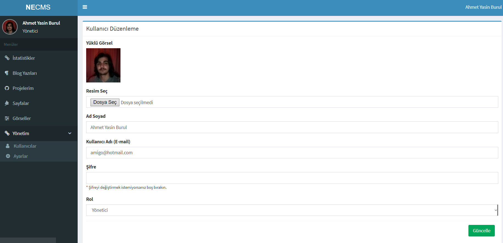

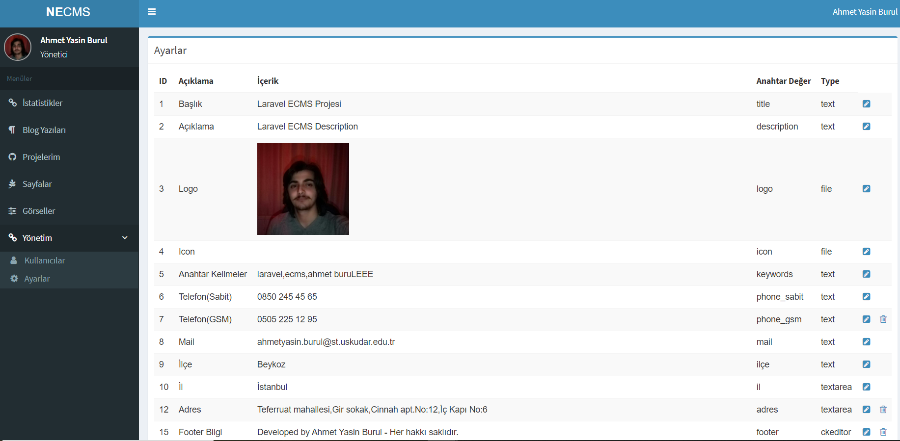

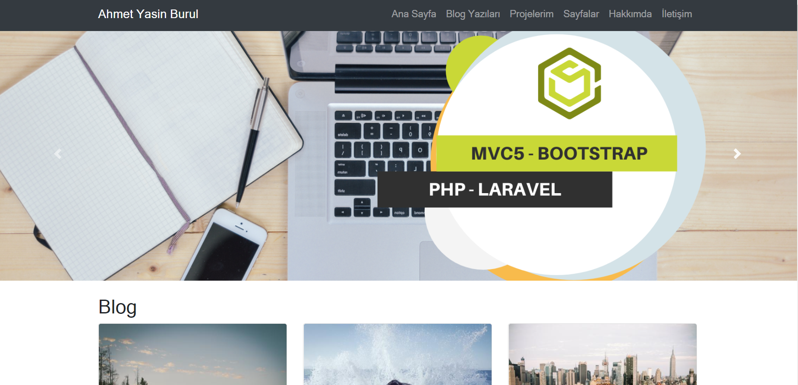

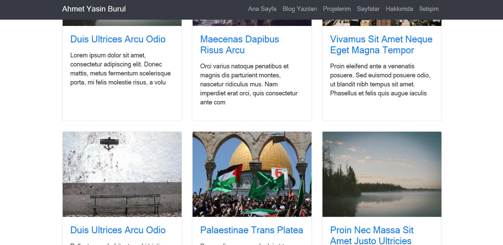

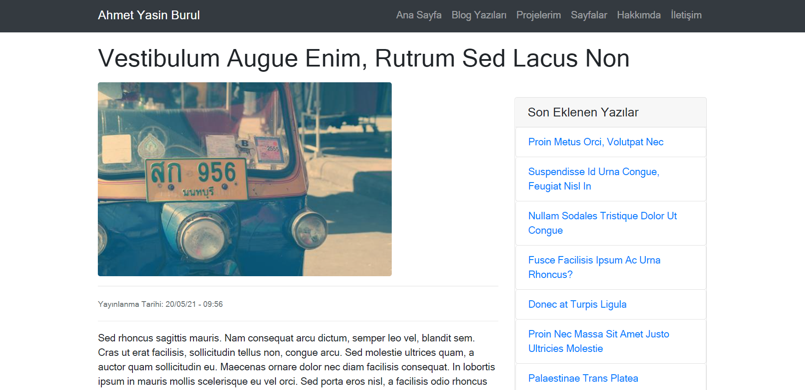

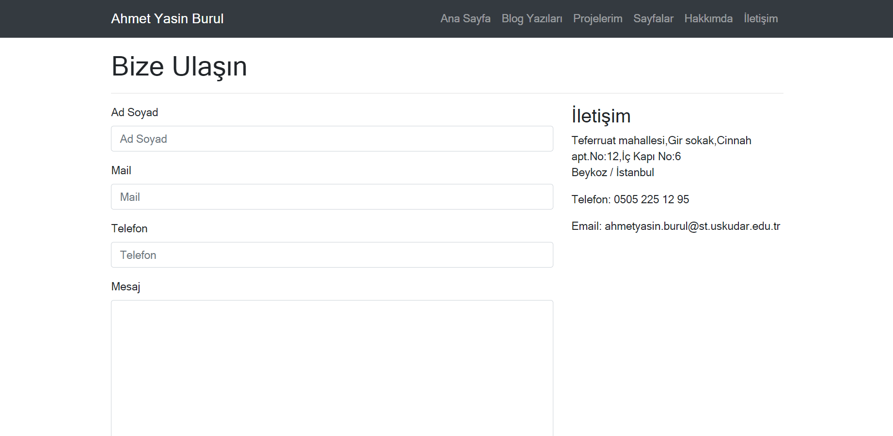

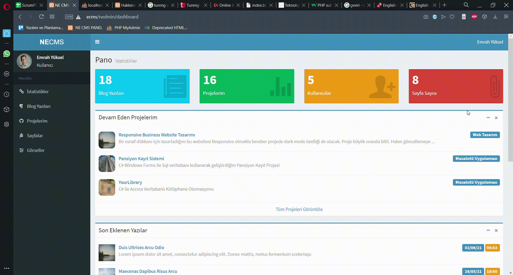

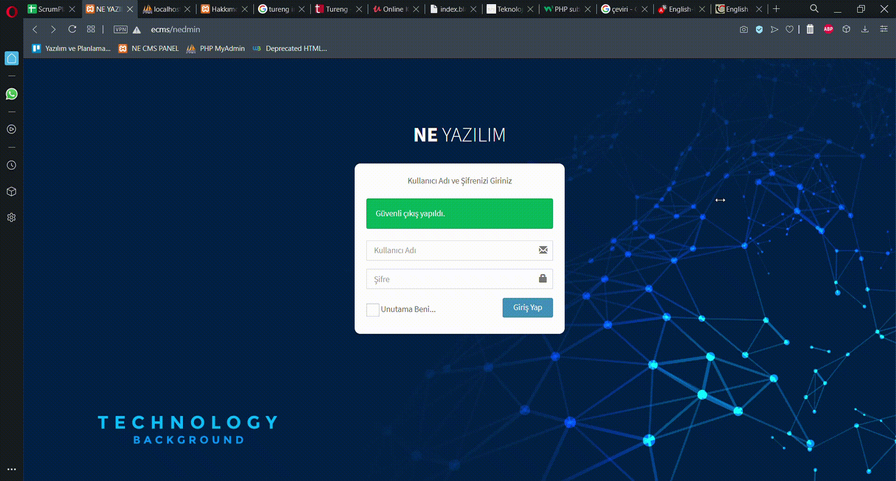

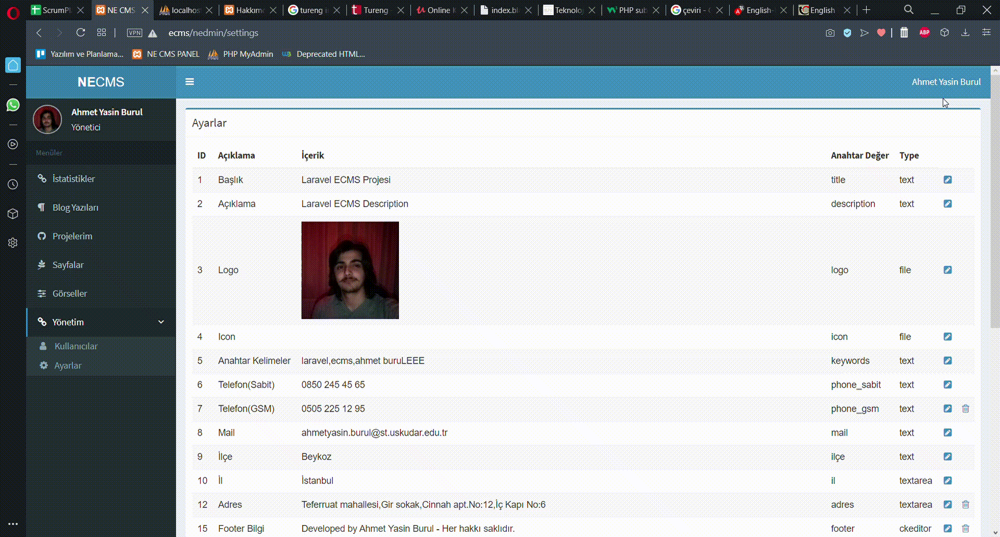

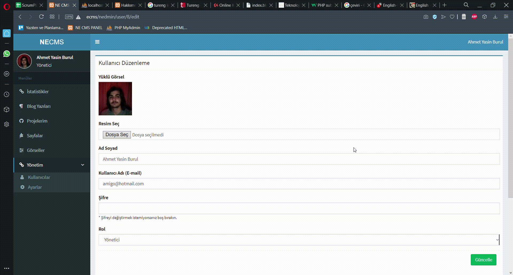

